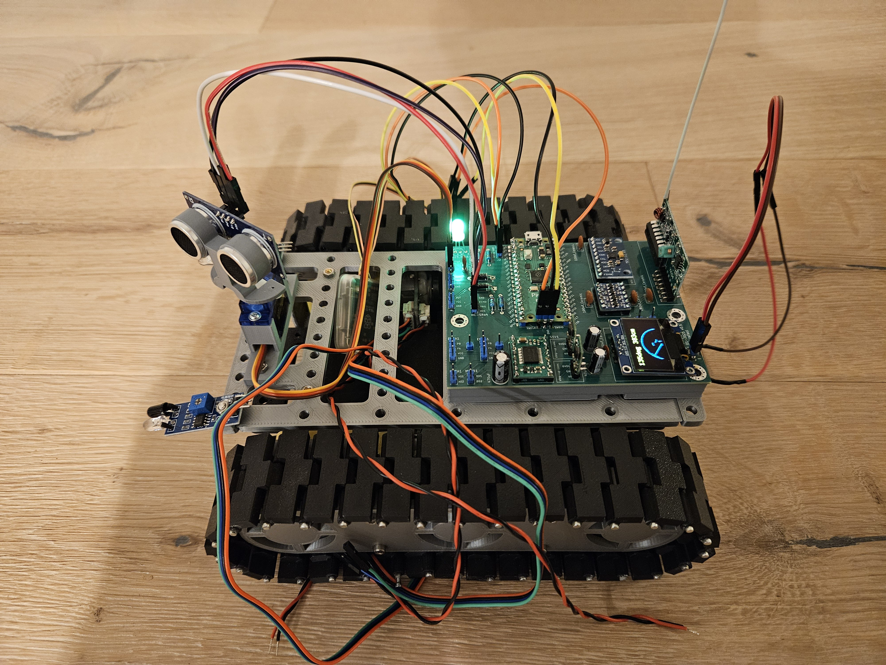

# simple-robot

A very simple robot with HC-SR04 distance sensor and autonomous as well as remote controlled movement written in Rust

*Side view showing the robot's profile and sensor placement*

Check out the robot navigating autonomously, download the demo video here: [Autonomous Operation](misc/media/autonomous-mode.mp4).

> Note: The initial version of this robot is preserved in the [`v1` tag](../../tree/v1). That version represents a simple but functional autonomous robot using basic components. The main branch now tracks the development of an improved version with the following planned enhancements:

- [ ] Sensor improvements:
  - [ ] Replace HC-SR04 ultrasonic sensor with IR sensor for more reliable obstacle detection
  - [ ] Add servo-mounted HC-SR04 as a poor man's LIDAR system for better spatial awareness
  - [ ] Integrate MPU6050 IMU for improved position control and orientation sensing.
- [ ] Remote control improvements:
  - [ ] Re-wire everything to decouple the RC receiver as much as possible from the motor driver and other noisy components -> for better reception when motors are running
- [ ] General circuit improvements:
  - [ ] Get rid of the voltage dividers for the RC receiver and the sensors, replace with level shifters instead
- [ ] Mobility improvements:
  - [ ] Replace the simple DC motors with better ones that have higher torque and encoders
  - [ ] Wire up the encoders and integrate them in code
  - [ ] Alter code to use encoders for better control and feedback, i.e. drive straight lines, make exact turns, etc.
- [ ] Power management improvements:
  - [ ] Improve the battery indicator by adding the yellow RGB pin and make a visually clearer battery indicator with that
  - [ ] Add a charger IC to charge and especially to protect the battery from deep discharge
  - [ ] Gracefully power down when the battery is low
  - [ ] Some sort of on/off switch would be kind of nice, even if plugging the ground cable into the breadboard as a switch is nerdy fun
- [ ] Mechanics improvements:
  - [ ] There must be a solution for tightening the tracks, which are too long by a few mm and sometimes come loose

I am not yet sure how many of these improvements I can implement in a reasonable timeframe. Maybe I will archive a v2 at some point along the way.

I will update the readme with these improvements once they are implemented. Let's get started!

## What is it?

This is a hobby project for my 9-year-old son, who wanted me to build a robot for him. The thing is a rather simple machine. I was aiming at the following:

+ Use a chassis that is easily printed. For now, I have settled on <https://www.thingiverse.com/thing:972768>. The author of that design has moved on to more sophisticated designs, I will surely come back to those. But right now this was just as simple and versatile as I wanted it to be, really cool what people have made.
  + The HC-SR04 holder is from here: <https://www.thingiverse.com/thing:189585>. It is not a perfect fit for the chassis but works well enough.
+ Use a Raspberry Pi Pico 2 for controller. Why on earth use such a powerful controller? -> Because I needed an excuse to tinker with that.
+ Use many of the electronics components some overly eager guy in my household bought a while ago in too large quantities. That is especially:
  + Li-Ion 18650 batteries and holders
  + step-up converters to 5V
  + HC-SR04 distance sensor
  + ...but of course this is ample opportunity to buy even more stuff... so a motor driver module, motors, and a simple RC unit and receiver... not to mention one absolutely has to buy two Pi Picos to make one device.

## What does it do?

The robot offers two main modes of operation: manual (RC control) and autonomous. Here's what each mode can do:

### Manual Mode (RC Control)

The robot can be controlled like a remote-controlled car using four buttons (A, B, C, D):

+ Button A:
  + Quick press: Forward movement. Every press increases speed.
  + Hold & Release: Switch to autonomous mode.
+ Button B:
  + Quick press: Turn right. Every press increases turn speed.
+ Button C:
  + Quick press: Turn left. Every press increases turn speed.
+ Button D:
  + Quick press: Backward movement. Every press increases speed.

The manual mode is pure RC control without any safety features - it's up to you to drive responsibly! Also, the ultra-cheap RC sender and receiver I used are awkward to use and reception range is poor, so this is more for having done it and testing stuff.

### Autonomous Mode

In this mode, the robot becomes self-driving with the following behaviors:

+ Continuously moves forward while monitoring its environment
+ Uses the HC-SR04 ultrasonic sensor to measure distances (in centimeters)
+ When detecting an obstacle:
  + Stops at a safe distance (currently set to avoid close encounters)
  + Executes an avoidance maneuver:
    1. Stops completely
    2. Backs up a bit
    3. Makes a random turn
    4. Decides if there is still an obstacle; if yes, executes avoidance maneuver again, and if no, resumes forward motion.

Any quick button press will end autonomous mode.

### System Features

Battery Management:

+ Continuous monitoring of battery voltage through a voltage divider
+ Battery level indicated via RGB LED: The color of the LED changes from green to red as the measured voltage decreases. Right now there is no deep discharge protection, so red is 2.5V and at that point better switch it off to protect the Li-Ion.

Auto Standby:

+ Automatic standby mode after 3 minutes of inactivity 
+ Monitors all user interactions (button presses) to reset the inactivity timer
+ In standby, motors are disabled to conserve power
+ Any button press will wake the robot's motors from standby

Sensor System:

+ HC-SR04 ultrasonic distance sensor
+ Measurements taken continuously at regular intervals
+ Uses moving median filtering for more reliable distance readings (I found that on a moving and vibrating platform the measurements vary wildly sometimes)

## Stuff used

Here is an overview of things used to make the robot. This is not supposed to be an exact BOM, but should give a good idea what to get. For an idea of what to connect to what, you can look at [resources.rs](src/system/resources.rs).

| Component | Description |
|:--|:--|
|Raspberry Pi Pico 2|Yeah, vastly overpowered for this project, could be many other alternatives, I am sure.|
|IC2262/2272 RC Module|RC transmitter and receiver unit bundle. Search for "IC2262/2272 rc ebay" and like a thousand of these pop up. I used a 433MHz variant including sender and receiver. Uses 5V power and output, so either use voltage dividers or logic level shifter to connect to the Pico.|
|HC-SR04|Ultrasonic distance sensor. Can be triggered with 3.3V, but needs 5V power and puts out 5V on the echo line, so either use a voltage divider or logic level shifter to connect to the Pico.|
|TB6612FNG|Motor driver module. Control driven with 3.3V, 5V power and 5V on the motor power lines.|
|5V DC geared motor|One for left and right each. There seems to be a somewhat standard form factor for these, but I did not find that form factor's name. The motor is at the end of the gearbox, and the gearbox has a one or two-sided shaft protruding at right angle from it. That shaft must go into the cog wheel.|
|U3V16F5|Step-up converter that can convert 3.3V to 5V. Plenty of other options besides this very device.|
|18650 Li-Ion battery|Battery and holder, in my case here 3350mAh and 4.2V max, 2.5V min. Powering one rail and feeding the Pico as well as the step-up converter from it, so both must be happy with what the battery delivers. Note: no over-discharge protection in my setup, so either add a charge board for protection or make sure to disconnect the battery early enough!|
|RGB LED|Whatever thing that can be driven by PWM on red and green pin each. Make sure to use appropriate resistors.|
|104 ceramic (100nF) capacitor|Across power supply lines of RC receiver, distance sensor and motor driver.|
|47uF electrolytic capacitor|Across power output of step-up converter. The RC receiver will not be happy with the power ripple otherwise.|
|470uF electrolytic capacitor|Across the motor power input of the motor driver. Motor switching will send power spikes down the supply so much as to kick out the debugger and what else it hurt I could not observe.|
|Resistors|At least 2 220Ω or 330Ω for the RGB LED.|
|More Resistors|When not using logic level shifters between the 5V signals and the Pico's GPIO, plenty to build voltage dividers. In that case 5 with 2-times the resistance of another 5 to get down from 5V to 3.3V|
|Wires|Plenty.|

Besides that, the printed model must be assembled. I printed in PLA and that went quite well. For assembly, you will need a couple of things from the hardware store, see the robot's Thingiverse link from above, the pictures there have an assembly instruction referring to what is needed.

## Side quests that became necessary

Building the thing I found no async driver for the HC-SR04, so I had to make one myself:

+ <https://github.com/1-rafael-1/hcsr04_async>
+ Also on <https://crates.io/crates/hcsr04_async>. 

This was fun :-)

Testing the ultrasonic sensor I found it gets even more unreliable when moving. So I searched for some moving median filtering solution, found none and made one myself:

+ <https://github.com/1-rafael-1/moving_median>
+ Also on <https://crates.io/crates/moving_median>

A little less fun.

## Disclaimer

I am a hobbyist, I have no formal electronics education and am quite new to the hobby. So expect imperfections. I am also still new to Rust and Embedded. By now I have a basic understanding of how things work and what are higher level things in embedded.

I use AI when coding, which has proven to be an excellent teaching tool for learning a new language. It allows me to explore more advanced concepts than I could on my own, making self-teaching much easier than it was just a year or two ago. That being said: The code is my take on how to do this, actual professionals will find a thousand things one could do better. In case you find a thing that could be better: Happy to know about it! :-)