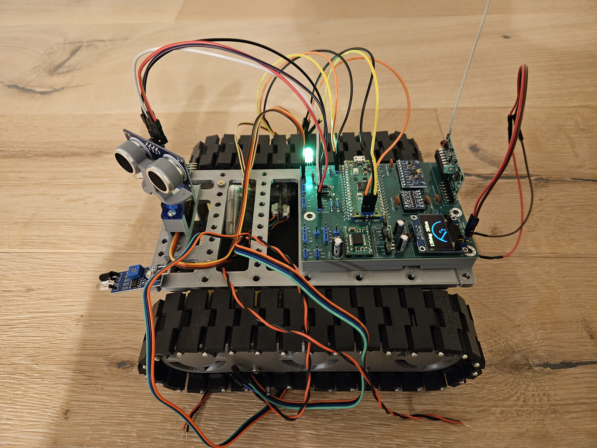
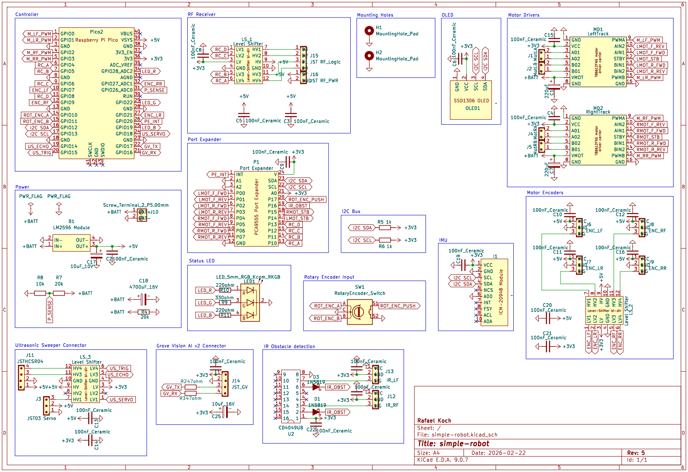
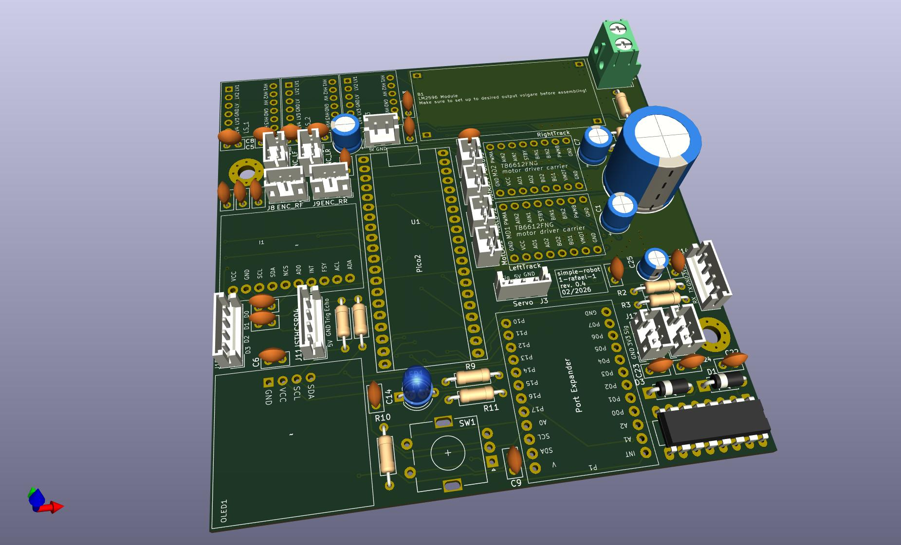

# simple-robot

A no-longer-too-simple robot with different sensors and autonomous as well as remote-controlled movement written in Rust. This is a WIP.

*Side view showing the robot's profile - picture of the v2 iteration, still WIP.*

Check out the v1-robot navigating autonomously, download the demo video here: [Autonomous Operation](misc/media/autonomous-mode.mp4).

> Note: The initial version of this robot is preserved in the [`v1` tag](../../tree/v1). That version represents a simple but functional autonomous robot using basic components. The main branch now tracks the development of an improved version.

## Current Status

**v2 Complete Overhaul - Hardware Phase**

The robot is undergoing a complete redesign with a second custom PCB. The new PCB has been ordered and is awaiting delivery. Once it arrives, firmware development will begin in earnest.

Current schematic and PCB designs can be found in the [KiCad directory](misc/KiCad/simple-robot).

## Licensing Overview

This project uses multiple licenses depending on the component:

- **Firmware code** (`src/`, `build.rs`, `Cargo.toml`, etc.): Licensed under **MIT License** (see `LICENSE-MIT.md`)
- **3D-printed chassis designs** (`misc/chassis/`): Based on the Proto-Tank Chassis by fustyles, licensed under **CC BY-SA 4.0** (see attribution below)
- **Schematic and hardware design** (`misc/media/schematic_picture.png`): Licensed under **CC BY-SA 4.0** (see `LICENSE-CC-BY-SA-4.0.md`)
- **Documentation** (`docs/`, `README.md`): Licensed under **CC BY-SA 4.0**

Please review the individual license files and attribution sections for detailed information.

---

## What should this one day be?

This started out as a hobby project for my 10-year-old son, who wanted me to build a robot for him. The thing started as a rather simple machine (v1) and then I got a little carried away.

In v1, the robot could move autonomously and avoid obstacles in a very simple way. That meant driving straight until an obstacle is detected, back up a little and then make a random turn. It was fun to watch and my son was happy with it. You could start and stop it with a remote control, and there even was some means to rc the robot around, but that was not the main point of the project.

This was so much fun that I am now working on a version with much-improved capabilities. The overall goal is to arrive at a system that can 

+ be controlled by a simple remote control
+ have the same dumb obstacle avoidance mode as before
+ have a more advanced autonomous mode where it uses spatial awareness obtained by the IMU and the ultrasonic sensor to navigate around obstacles
+ have a follow-me mode where it follows an object in front of it, using a small AI module & camera
+ have an autonomous object finding mode where it searches for a given object until it finds it, using the same AI module & camera as before

People have pointed out to me various things. The gist is that there are of course ready-made chassis solutions, ready-made RTOS for robotics and even probably complete systems available and that I am setting out to solve things that can be solved with much less effort by using existing things in code as well as hardware. This is all true and I do not dispute it. My motivation is different, though: I am not truly that much interested in having the actual robot, I have no use case at all for it, in fact. I just truly enjoy the process of building, figuring out how to do things, learning a ton of new stuff and it passes my rare spare time in a rewarding way.

## So where are we now?

I am in the process of a complete overhaul of everything. I figured out that I will need to go through these steps to get to the final result:

1. Do the platform things first. That means the first milestone is to get to a chassis that can do the very basics reliably. This means we must be able to drive straight lines and do turns with some degree of precision. This sounds very basic and it is, but I am finding this to be challenging already. A home-printed chassis and tracks as well as cheap dc motors mean that from the start there must be calibration for imperfection and a lot of sensor feedback to get close to the goal. 
At this point I have the code mostly in place to do this and breadboarded enough hardware to test it. It sort of works now, but there are a few things unproven and likely needing more work. My turns still overshoot and the straight lines are wobbly. I am hoping this is mostly down to not calibrating the 9-axis IMU properly yet, the magnetometer requires to flip and move the contraption around and a breadboarded ugliness of modules and wires does not allow for that. So all my tests were 6-axis only yet and the straight lines were no IMU support at all, just motor encoders.
2. In order to get 1. done all the modules I use need to go onto a PCB. The physical mess of wires alone is an issue by itself and also I measured the ground bounce of doom on the breadboard. I am suspecting the I2C bus also dropped out a few times and all that being incredibly noisy, there is no thinking about RC control. So at this point I have made an overhauled schematic and my first 4-layer PCB design. This is ordered and I am waiting for it to arrive.
3. While waiting for 2. I cleaned the code up to some degree. What I will do next is to design the chassis parts that will allow me to mount the new PCB. I also need to design something to fix the battery pack in place and finally also mounts for the front sensor array. That is a few things, so the servo & HC-SR04, two IR proximity sensors and the camera for the AI module must go somewhere. While at it the AI board and RF transceiver module need to be mounted as well. My FreeCAD skills are not great, so this will take time :-)
4. Once all that is done and printed and the PCB arrives, a few sessions of soldering and assembly will be needed. Going to be a struggle because I already know I am going to make some mistakes.
5. With all that done and working (hopefully) I can start to implement more complex driving modes. The first one will be to get the dumb obstacle avoidance mode of V1 working with the new platform. While doing that some sort of user control will be implemented, we have the transceiver and also a rotary encoder on the PCB and an OLED display, so some basic menu can be made for selections, resetting and initiating calibration and such stuff.
6. Once that is done, the more advanced autonomous mode can be implemented, which will use the IMU and the ultrasonic sensor to navigate around obstacles. First instance of making some sort of spatial matrix and learning about how to make the robot know where it actually is and how that relates to obstacles it detected. Will need the ultrasonic sweeping servo for that, and will revive the code for that slumbering here for a long while.
7. After that, the follow-me mode can be implemented, which will use the camera and the AI module to follow an object in front of it. I believe the module can give not only the fact of detection but also position in the camera view, so we should be able to perform turns and speed adjustments to keep the object in the center of the view.
8. It might turn out to be easier to implement the autonomous object finding mode before the follow-me mode, but that is the last milestone anyway. This will use the same camera and AI module as the follow-me mode, but instead of following an object it will search for a given object until it finds it. That means some sort of search pattern needs to be implemented, so scanning around for the object and moving to some place if not found and repeating until it is found. If I can manage some sort of control about where we already looked and where we have not.

At the end of it all and in case of success we will have a thing that is barely as smart as a vacuum cleaner robot :-)

## Schematic

You can find the KiCad project here: [misc/KiCad/simple-robot](misc/KiCad/simple-robot). Some of the boards I used had no symbols & footprints and so I created them as I went. You can find them here: [misc/KiCad/symbols](misc/KiCad/symbols). The Pi Pico symbol I found online here: [ncarandini/KiCad-RP-Pico](https://github.com/ncarandini/KiCad-RP-Pico).

*The v2 schematic (current design)*

*The v2 PCB layout (current design)*

## 3D Printing

The robot chassis and various mounting components are designed to be 3D printed. I printed all parts in PLA and they worked quite okay so far. The 3D models are stored in the `misc/chassis` directory with both FreeCAD source files (.FCStd) and print-ready formats (.3mf, .stl).

For convenient printing with a Bambu Lab 3D printer, two Bambu Studio print projects are included:

- **print project.3mf** - Complete robot chassis assembly including the base frame, servo mount, HC-SR04 ultrasonic sensor mount, and IR sensor mounts
- **track pin print project.3mf** - Track pin components for securing and tensioning the robot's tracks (recently added)

The individual component files are also available if you prefer to customize your print settings:
- BaseFrame - edit.3mf/stl (main chassis frame)
- 9g servo mount.3mf (servo mounting bracket)
- hc-sr04 mount.3mf (ultrasonic sensor mount)
- IR Sensor mount.3mf (infrared sensor mounting)
- PCB mounting base.3mf (circuit board support)
- track pin.3mf (individual track pin component)

For more details on the chassis components, file formats, and assembly, see [misc/chassis/README.md](misc/chassis/README.md).

## Side quests that became necessary

Building the thing I found no async driver for the HC-SR04, so I had to make one myself:

- <https://github.com/1-rafael-1/hcsr04_async>
- Also on <https://crates.io/crates/hcsr04_async>.

This was fun :-)

Testing the ultrasonic sensor I found it gets even more unreliable when moving. So I searched for some moving median filtering solution, found none and made one myself:

- <https://github.com/1-rafael-1/moving_median>
- Also on <https://crates.io/crates/moving_median>

A little less fun.

I replaced the initial MPU9250/MPU6050 I never truly got to work with the ICM20948, a more modern 9-axis IMU from the same manufacturer (TDK InvenSense). The ICM20948 offers better performance and I created a driver for it:

- <https://github.com/1-rafael-1/ICM-20948-rs>
- Also on <https://crates.io/crates/icm20948-rs>

The driver supports async I2C operations and includes examples for RP2350. This was to a degree vibe-coded because that is truly out of my league, but it seems to work okay so far. I am sure there are many things that could be done better, but it is a start and I can now get good orientation data from the IMU, which is a big step forward for the project.

## The code

The code is written in Rust and makes heavy use of the Embassy framework. I opted for a very modular approach, where mostly everything is an async task. These tasks all report into a central orchestration task, which then decides what to do next and is the only task that is allowed to send things to other tasks. Or should be, if I did not mess up somewhere.

The orchestration is based on events, which are raised from the tasks to the orchestration task. I opted to keep all tasks running all the time, even if they are not needed at the moment. Such tasks are signaled to either work or await. I found it easier to reason about the system that way. It is also easy to add/remove/refactor tasks that way.

There are two modules, `system` and `task`. The `system` module contains rather general things like the event system and state. The `task` module contains the tasks that are run by the system.

### State Modules and Lock Order

The global state is split into domain-specific modules under `system/state/*` to reduce contention and keep hot paths lock-free where possible:

- `system/state/power.rs`
- `system/state/motion.rs`
- `system/state/perception.rs`
- `system/state/calibration.rs`

UI mode state lives in `task/ui/state.rs` (via `UI_STATE`) and is kept separate from the system state lock order.

When multiple state mutexes must be held at the same time, a uniform lock order is required to avoid deadlocks:

1. `POWER_STATE`
2. `CALIBRATION_STATE`
3. `PERCEPTION_STATE`
4. `MOTION_STATE`

The `main.rs` file is the entry point of the program but does nothing besides initializing some resources and then spawning all the tasks.

Right now I am using just one core of the RP2350 and the nominal 150 MHz clock speed. The firmware uses just a few percent of the flash space and about 20% of the RAM. So there should be plenty of room to fit the system into. 

At the moment a bottleneck I might see coming is the I2C bus, there is just one that serves the IMU, the port expander and the OLED. In theory a much larger number of devices can be on one bus but I do not yet know if the relatively big chunks of data to the OLED and the frequency of the IMU data will be friends. I hope it works out, because I am out of pins on the Pico2 and so moving things to a second bus will be not easy. So if that fails I am in trouble.

As for computation power I believe I will be fine. If I find that whatever we do saturates core0 there is a second core I could use. Embassy allows for multiple executors to co-exist and tasks could be shoved onto core1. And if that is not enough the RP2350 can be overclocked easily. Plenty of headroom, likely not required.

## Acknowledgments & Attribution

### Proto-Tank Chassis Design

The robot's tracked chassis is based on the [Proto-Tank](https://www.thingiverse.com/thing:972768) project, which is licensed under [Creative Commons Attribution 4.0 International](https://creativecommons.org/licenses/by/4.0/).

The Proto-Tank design has been modified and adapted for the simple-robot project to integrate custom motor mounts, PCB solutions, and sensor integration.

See [misc/chassis/ATTRIBUTION.md](misc/chassis/ATTRIBUTION.md) for full attribution details and license information.

## Disclaimer

I am a hobbyist, I have no formal electronics education and am still relatively new to the hobby (2.5 years now). I am also still as new to Rust and Embedded. By now I have a basic understanding of how things work and of what are higher level things in embedded. Enough for maker-level, far off from actual professional level. So expect imperfections.

I use AI when coding, which has proven to be an excellent teaching tool for learning a new language. It allows me to explore more advanced concepts than I could on my own, making self-teaching much easier than it was just a year or two ago. That being said: The code is my take on how to do this, actual professionals will find a thousand things one could do better. In case you find a thing that could be better: Happy to hear about it, get in touch! :-)

## Component Summary

The following is a summary of the components used in the v2 schematic (see [KiCad project](misc/KiCad/simple-robot)).

### Microcontroller

| Ref | Component | Notes |
|-----|-----------|-------|
| U1 | Raspberry Pi Pico 2 (RP2350) | Main controller |

### Sensors

| Ref | Component | Notes |
|-----|-----------|-------|
| I1 | ICM-20948 module | 9-axis IMU (accelerometer, gyroscope, magnetometer), I2C |
| J11 | HC-SR04 ultrasonic sensor | Connected via JST 4-pin, with servo sweeper |
| J12, J13 | IR obstacle detection sensors (×2) | Right-front and left-front |
| J14 | Grove Vision AI v2 | Camera/AI module, JST 4-pin |

### Motor Control

| Ref | Component | Notes |
|-----|-----------|-------|
| MD1, MD2 | TB6612FNG motor driver carriers (×2) | Left track & right track |
| J6–J9 | Motor encoders (×4) | LF, LR, RF, RR via JST 3-pin |
| J1, J2, J4, J5 | DC motor connectors (×4) | JST 2-pin |

### Communication & IO Expansion

| Ref | Component | Notes |
|-----|-----------|-------|
| P1 | PCA9555 I2C port expander | 16-bit GPIO expander |
| LS_1, LS_2, LS_3 | Bi-directional level shifters (×3) | 3.3V ↔ 5V |
| U2 | CD4049UB | Hex inverting buffer (DIP-16) |

### User Interface

| Ref | Component | Notes |
|-----|-----------|-------|
| OLED1 | SSD1306 OLED display module | I2C |
| SW1 | Rotary encoder with push switch | User input |
| LED1 | 5mm RGB LED (common cathode) | Status indicator |
| — | RF receiver | Remote control, via JST 3-pin |

### Power

| Ref | Component | Notes |
|-----|-----------|-------|
| B1 | LM2596 DC-DC buck converter module | Steps battery voltage down |
| J10 | Screw terminal (2-pin) | Battery input |
| D1, D3 | 1N5819 Schottky diodes (×2) | Power path protection |

### Passive Components

| Ref | Component | Notes |
|-----|-----------|-------|
| C2–C16, C19–C24, C26 | 100nF ceramic capacitors (×20) | Decoupling |
| C18 | 4700µF 16V electrolytic | Bulk decoupling (motors) |
| C1, C7 | 220µF polarized (×2) | |
| C17 | 220µF 10V | |
| C25 | 10µF 16V | |
| R2, R3 | 47Ω (×2) | |
| R5, R6 | 1kΩ (×2) | |
| R8 | 10kΩ | |
| R4, R7 | 20kΩ (×2) | |
| R10, R11 | 220Ω (×2) | LED current limiting |
| R9 | 330Ω | LED current limiting |
