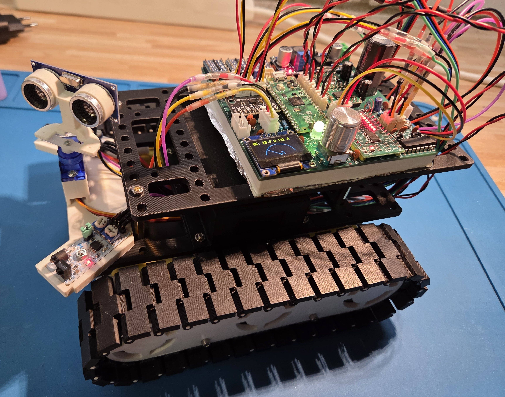
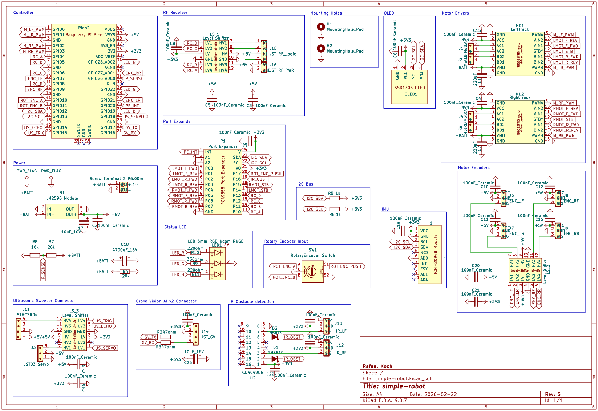
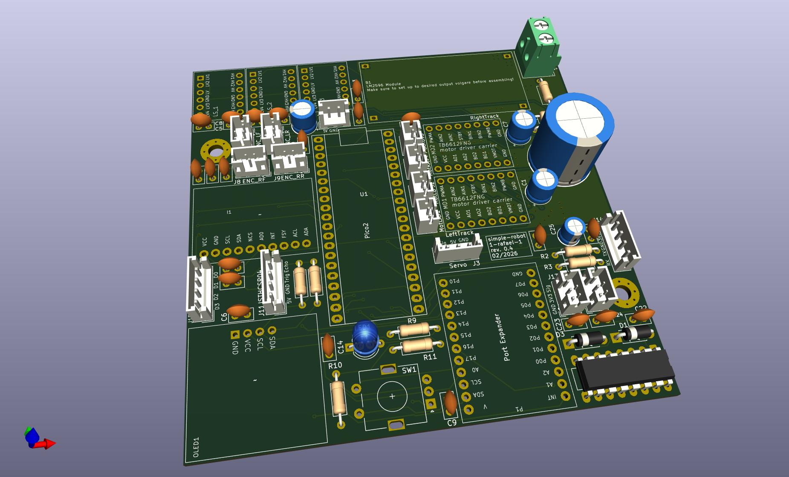

# simple-robot

A not-too-simple tracked robot with autonomous navigation and sensor-driven obstacle avoidance, written in Rust with Embassy. v2 reached the limits of its hardware platform; development continues in a new repository.

*Side view showing the robot's profile — the v2 iteration.*

## Project History

This started out as a hobby project for my 10-year-old son, who wanted me to build a robot for him. The thing started as a rather simple machine (v1) and then I got a little carried away. Check out the v1-robot navigating autonomously, download the demo video here: [Autonomous Operation](misc/media/autonomous-mode.mp4).

> Note: The initial version of this robot is preserved in the [`v1` tag](../../tree/v1). That version represents a simple but functional obstacle-avoiding robot using basic components. The v2 iteration described here is tagged [`v2`](../../tree/v2) and is now mothballed.

In v1, the robot could move autonomously by avoiding obstacles in a very simple way. That meant driving straight until an obstacle is detected, back up a little and then make a random turn. It was fun to watch and my son was happy with it.

v2 set out to be much more capable. The plan was to add spatial awareness through an IMU and a sweeping ultrasonic sensor, build more sophisticated autonomous navigation modes, and eventually integrate an AI camera module for follow-me and object-finding. Some of that worked out; some of it ran into hardware limits that couldn't be solved on this platform.

People have pointed out to me various things. The gist is that there are of course ready-made chassis solutions, ready-made RTOS for robotics and even probably complete systems available and that I am setting out to solve things that can be solved with much less effort by using existing things in code as well as hardware. This is all true and I do not dispute it. My motivation is different, though: I am not truly that much interested in having the actual robot, I have no use case at all for it, in fact. I just truly enjoy the process of building, figuring out how to do things, learning a ton of new stuff and it passes my rare spare time in a rewarding way.

## What v2 Achieved

The v2 firmware is a fully integrated platform built on Embassy async with a task-oriented architecture. A central orchestrator runs an event loop, dispatching sensor events to behavior handlers and UI updates. The drive subsystem uses a single-producer command queue with intents for distance drives, in-place rotations, and brake/coast settling — all with IMU-corrected feedback and ramp-down near targets. Mode-agnostic obstacle detection triggers emergency braking across all modes.

The robot carries a custom 4-layer PCB designed in KiCad, hand-soldered, with an RP2350 at 150 MHz. It drives four TT motors through two TB6612FNG motor drivers, reads four hall-effect encoders, and runs an ICM-20948 9-axis IMU with on-chip DMP sensor fusion. An HC-SR04 ultrasonic sensor on a servo performs 0–160° sweeps with a 30° cone correction algorithm, feeding a shared sweep buffer used by both the OLED's radar visualization and the autonomous navigation modes. Two front-facing IR sensors provide close-range collision detection, and a PCA9555 I2C port expander handles motor direction/standby pins and additional inputs. An RGB LED indicates battery state and obstacle alerts.

The UI is driven by an EC11 rotary encoder with push button and an SSD1306 OLED display. A menu system exposes hardware tests (motors, encoders, IMU, ultrasonic sweep, drive accuracy), calibration routines (motor speed, IMU, distance factor), and autonomous mode selection. Calibration data persists to flash storage.

Two autonomous modes are implemented:
- **Coast-and-avoid** — drives forward until an obstacle is detected, backs up, and turns a random angle. Simple but reliable.
- **Attempt straight line** — the user sets a target distance (100–1000 cm); the robot sweeps the ultrasonic sensor, performs gap analysis with drift correction, and navigates leg-by-leg toward the goal while avoiding obstacles.

Three side-quest crates were published along the way: [`hcsr04_async`](https://crates.io/crates/hcsr04_async) (async HC-SR04 driver), [`moving_median`](https://crates.io/crates/moving_median) (moving median filter), and [`icm20948-rs`](https://crates.io/crates/icm20948-rs) (ICM-20948 driver with DMP support).

## Why v2 Ends Here

The robot works, but it cannot reach the spatial awareness and navigation precision the original vision demanded. Several hard limits converge:

**Spatial awareness is the primary bottleneck.** The HC-SR04 ultrasonic sensor, even with servo sweeping and cone correction, is fundamentally imprecise. Its 30° detection cone could have been overcome algorithmically, but it produces false readings far too easily — a carpet, a floor tile seam, or a slightly textured surface registers as an obstacle. That makes reliable navigation impossible. The front-facing IR sensors work but have very short range and would require redesigning the sensor array holder to be truly useful. There is no downward-facing sensor to detect stairs or ledges.

**The board is out of pins.** The RP2350 on a Pico 2, even with a PCA9555 port expander, has every pin in use. There is no room to add a downward edge sensor, a better spatial sensor, or anything else. Some of those pins are spent on RC receiver inputs and a UART for an AI board that were never fully utilized, and on four motor encoders and two motor driver modules — overhead that a two-motor design would eliminate.

**Four TT motors reach a precision ceiling.** Two motors per track were necessary to move the Proto-Tank chassis, but that doubled the encoder and PWM pin count. The cheap hall-effect encoders and the inherent variability of TT motors mean no amount of calibration will deliver the positional accuracy needed for reliable dead-reckoning navigation.

**The I2C bus is shared** between the IMU, the OLED display, and the port expander. Motor direction changes go through the expander on that same bus. This never caused a hard failure in testing, but it is a fragile design with no headroom.

None of these are software problems. They are hardware constraints of a design that started from a simple tank chassis and grew organically. v2 went as far as it could on this platform.

## What's Next

To get here took ages, and quite some time this was a UFO (UnFinished Object). I have plans for a next iteration, but no idea when I will find the time. So.... fingers crossed this will not be another UFO. 

The next iteration will - i think - build on v2's architecture — the event system, orchestrator, UI subsystem, drive command model, and state management all proved themselves — but on new hardware:

- **Better motors.** Two high-torque encoder motors (one per track) instead of four TT motors, drastically reducing pin count and improving precision. The exact motor type is still being evaluated (JGB37-520 hall-encoder DC motors are a strong candidate).
- **LiDAR for spatial awareness.** A small spinning LiDAR unit replaces the ultrasonic sensor and servo entirely, delivering a 360° planar point cloud with far better accuracy and no moving-wait overhead.
- **Laser rangefinders** on all four edges for collision control, plus downward-facing ToF sensors for stair and ledge detection.
- **A custom chassis** designed around the new motors, with ball-bearing sprockets for smoother and more precise operation.
- **Reserved UART and power** for an AI camera module, so object detection can finally be added without redesigning the board.
- **The ICM-20948, SSD1306 OLED, EC11 rotary encoder, and RGB LED** carry over — these all worked well.

Development will happen in a new repository. A link will be added here once it is public. 

## Licensing Overview

This project uses multiple licenses depending on the component:

- **Firmware code** (`src/`, `build.rs`, `Cargo.toml`, etc.): Licensed under **MIT License** (see `LICENSE-MIT.md`)
- **3D-printed chassis designs** (`misc/chassis/`): Based on the Proto-Tank Chassis by fustyles, licensed under **CC BY-SA 4.0** (see attribution below)
- **Schematic and hardware design** (`misc/media/schematic_picture.png`): Licensed under **CC BY-SA 4.0** (see `LICENSE-CC-BY-SA-4.0.md`)
- **Documentation** (`docs/`, `README.md`): Licensed under **CC BY-SA 4.0**

Please review the individual license files and attribution sections for detailed information.

## Schematic

You can find the KiCad project here: [misc/KiCad/simple-robot](misc/KiCad/simple-robot). Some of the boards I used had no symbols & footprints and so I created them as I went. You can find them here: [misc/KiCad/symbols](misc/KiCad/symbols). The Pi Pico symbol I found online here: [ncarandini/KiCad-RP-Pico](https://github.com/ncarandini/KiCad-RP-Pico).

*The v2 schematic (current design)*

*The v2 PCB layout (current design)*

## 3D Printing

The robot chassis and various mounting components are designed to be 3D printed. I printed all parts in PLA and they worked quite okay so far. The 3D models are stored in the `misc/chassis` directory with both FreeCAD source files (.FCStd) and print-ready formats (.3mf, .stl).

For convenient printing with a Bambu Lab 3D printer, two Bambu Studio print projects are included:

- **print project.3mf** - Complete robot chassis assembly including the base frame, servo mount, HC-SR04 ultrasonic sensor mount, and IR sensor mounts
- **track pin print project.3mf** - Track pin components for securing and tensioning the robot's tracks (recently added)

The individual component files are also available if you prefer to customize your print settings:
- BaseFrame - edit.3mf/stl (main chassis frame)
- 9g servo mount.3mf (servo mounting bracket)
- hc-sr04 mount.3mf (ultrasonic sensor mount)
- IR Sensor mount.3mf (infrared sensor mounting)
- PCB mounting base.3mf (circuit board support)
- track pin.3mf (individual track pin component)

For more details on the chassis components, file formats, and assembly, see [misc/chassis/README.md](misc/chassis/README.md).

## Side quests that became necessary

Building the thing I found no async driver for the HC-SR04, so I had to make one myself:

- <https://github.com/1-rafael-1/hcsr04_async>
- Also on <https://crates.io/crates/hcsr04_async>.

This was fun :-)

Testing the ultrasonic sensor I found it gets even more unreliable when moving. So I searched for some moving median filtering solution, found none and made one myself:

- <https://github.com/1-rafael-1/moving_median>
- Also on <https://crates.io/crates/moving_median>

A little less fun.

I replaced the initial MPU9250/MPU6050 I never truly got to work with the ICM20948, a more modern 9-axis IMU from the same manufacturer (TDK InvenSense). The ICM20948 offers better performance and I created a driver for it:

- <https://github.com/1-rafael-1/ICM-20948-rs>
- Also on <https://crates.io/crates/icm20948-rs>

The driver supports async I2C operations and includes examples for RP2350. This was to a degree vibe-coded because that is truly out of my league, but it seems to work okay so far. I am sure there are many things that could be done better, but it is a start and I can now get good orientation data from the IMU, which is a big step forward for the project.

## The code

The code is written in Rust and makes heavy use of the Embassy framework. The architecture is task‑oriented, with a central orchestration loop handling events and routing them to behavior modules. Tasks stay resident and idle when not needed, which keeps the control flow predictable and makes it easy to evolve the system.

The drive subsystem is explicitly single‑producer/single‑executor: higher‑level modes build queues of drive steps, submit them to the drive queue executor, and await a single queue completion. Per‑step completion is internal to the executor, and interrupts remain available for preemption.

There are two modules, `system` and `task`. The `system` module contains rather general things like the event system and state. The `task` module contains the tasks that are run by the system.

### State Modules and Lock Order

The global state is split into domain-specific modules under `system/state/*` to reduce contention and keep hot paths lock-free where possible:

- `system/state/power.rs`
- `system/state/motion.rs`
- `system/state/perception.rs`
- `system/state/calibration.rs`

UI mode state lives in `task/ui/state.rs` (via `UI_STATE`) and is kept separate from the system state lock order.

When multiple state mutexes must be held at the same time, a uniform lock order is required to avoid deadlocks:

1. `POWER_STATE`
2. `CALIBRATION_STATE`
3. `PERCEPTION_STATE`
4. `MOTION_STATE`

The `main.rs` file is the entry point of the program but does nothing besides initializing some resources and then spawning all the tasks.

Right now I am using just one core of the RP2350 and the nominal 150 MHz clock speed. The firmware uses just a few percent of the flash space and about 20% of the RAM. So there should be plenty of room to fit the system into. 

At the moment a bottleneck I might see coming is the I2C bus, there is just one that serves the IMU, the port expander and the OLED. In theory a much larger number of devices can be on one bus but I do not yet know if the relatively big chunks of data to the OLED and the frequency of the IMU data will be friends. I hope it works out, because I am out of pins on the Pico2 and so moving things to a second bus will be not easy. So if that fails I am in trouble.

As for computation power I believe I will be fine. If I find that whatever we do saturates core0 there is a second core I could use. Embassy allows for multiple executors to co-exist and tasks could be shoved onto core1. And if that is not enough the RP2350 can be overclocked easily. Plenty of headroom, likely not required.

## Acknowledgments & Attribution

### Proto-Tank Chassis Design

The robot's tracked chassis is based on the [Proto-Tank](https://www.thingiverse.com/thing:972768) project, which is licensed under [Creative Commons Attribution 4.0 International](https://creativecommons.org/licenses/by/4.0/).

The Proto-Tank design has been modified and adapted for the simple-robot project to integrate custom motor mounts, PCB solutions, and sensor integration.

See [misc/chassis/ATTRIBUTION.md](misc/chassis/ATTRIBUTION.md) for full attribution details and license information.

## Disclaimer

I am a hobbyist, I have no formal electronics education and am still relatively new to the hobby (2.5 years now). I am also still as new to Rust and Embedded. By now I have a basic understanding of how things work and of what are higher level things in embedded. Enough for maker-level, far off from actual professional level. So expect imperfections.

I use AI when coding, which has proven to be an excellent teaching tool for learning a new language. It allows me to explore more advanced concepts than I could on my own, making self-teaching much easier than it was just a year or two ago. That being said: The code is my take on how to do this, actual professionals will find a thousand things one could do better. In case you find a thing that could be better: Happy to hear about it, get in touch! :-)

## Component Summary

The following is a summary of the components used in the v2 schematic (see [KiCad project](misc/KiCad/simple-robot)).

### Microcontroller

| Ref | Component | Notes |
|-----|-----------|-------|
| U1 | Raspberry Pi Pico 2 (RP2350) | Main controller |

### Sensors

| Ref | Component | Notes |
|-----|-----------|-------|
| I1 | ICM-20948 module | 9-axis IMU (accelerometer, gyroscope, magnetometer), I2C |
| J11 | HC-SR04 ultrasonic sensor | Connected via JST 4-pin, with servo sweeper |
| J12, J13 | IR obstacle detection sensors (×2) | Right-front and left-front |
| J14 | Grove Vision AI v2 | Camera/AI module, JST 4-pin |

### Motor Control

| Ref | Component | Notes |
|-----|-----------|-------|
| MD1, MD2 | TB6612FNG motor driver carriers (×2) | Left track & right track |
| J6–J9 | Motor encoders (×4) | LF, LR, RF, RR via JST 3-pin |
| J1, J2, J4, J5 | DC motor connectors (×4) | JST 2-pin |

### Communication & IO Expansion

| Ref | Component | Notes |
|-----|-----------|-------|
| P1 | PCA9555 I2C port expander | 16-bit GPIO expander |
| LS_1, LS_2, LS_3 | Bi-directional level shifters (×3) | 3.3V ↔ 5V |
| U2 | CD4049UB | Hex inverting buffer (DIP-16) |

### User Interface

| Ref | Component | Notes |
|-----|-----------|-------|
| OLED1 | SSD1306 OLED display module | I2C |
| SW1 | Rotary encoder with push switch | User input |
| LED1 | 5mm RGB LED (common cathode) | Status indicator |
| — | RF receiver | Remote control, via JST 3-pin |

### Power

| Ref | Component | Notes |
|-----|-----------|-------|
| B1 | LM2596 DC-DC buck converter module | Steps battery voltage down |
| J10 | Screw terminal (2-pin) | Battery input |
| D1, D3 | 1N5819 Schottky diodes (×2) | Power path protection |

### Passive Components

| Ref | Component | Notes |
|-----|-----------|-------|
| C2–C16, C19–C24, C26 | 100nF ceramic capacitors (×20) | Decoupling |
| C18 | 4700µF 16V electrolytic | Bulk decoupling (motors) |
| C1, C7 | 220µF polarized (×2) | |
| C17 | 220µF 10V | |
| C25 | 10µF 16V | |
| R2, R3 | 47Ω (×2) | |
| R5, R6 | 1kΩ (×2) | |
| R8 | 10kΩ | |
| R4, R7 | 20kΩ (×2) | |
| R10, R11 | 220Ω (×2) | LED current limiting |
| R9 | 330Ω | LED current limiting |
