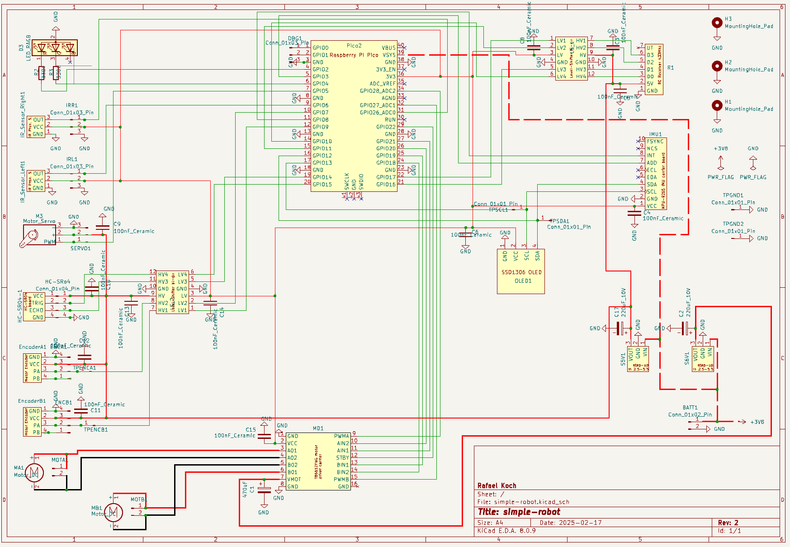
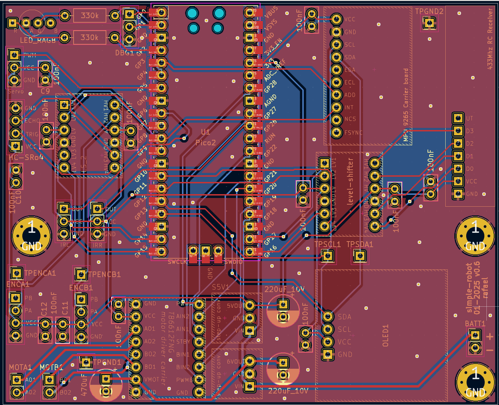

# simple-robot

A no-longer-too-simple robot with different sensors and autonomous as well as remote controlled movement written in Rust.

*Side view showing the robot's profile - picture of the v2 iteration, still WIP.*

Check out the v1-robot navigating autonomously, download the demo video here: [Autonomous Operation](misc/media/autonomous-mode.mp4).

> Note: The initial version of this robot is preserved in the [`v1` tag](../../tree/v1). That version represents a simple but functional autonomous robot using basic components. The main branch now tracks the development of an improved version.

## Licensing Overview

This project is licensed under the MIT License with one exception:

- **MIT License** - Applies to all content: Rust code, custom 3D models, PCB designs, and documentation (see [LICENSE](LICENSE))
- **Exception: Original Proto-Tank Design Files** - Located in `misc/chassis/proto-tank/`, licensed under CC BY 4.0. See [misc/chassis/ATTRIBUTION.md](misc/chassis/ATTRIBUTION.md) for details

For complete licensing information, refer to:
- [LICENSE](LICENSE) file (MIT - applies to everything except original Proto-Tank files)
- [misc/chassis/ATTRIBUTION.md](misc/chassis/ATTRIBUTION.md) (CC BY 4.0 for original Proto-Tank)

## What is it?

This is a hobby project for my 9-year-old son, who wanted me to build a robot for him. The thing started as a rather simple machine (v1) and then I got a little carried away.

In v1 the robot could move autonomously and avoid obstacles in a very simple way. That meant driving straight until an obstacle is detected, back up a little and then make a random turn. It was fun to watch and my son was happy with it.

Enter v2: I was unhappy with the ultrasonic sensor, I was unhappy with the straight driving, which was more a banana curve, I was unhappy with the turning, which was in reality just done by spending a random time on the turning motion. So one thing led to another and I ended up with a massive project that is still not finished. It has become that sort of project, where finishing one thing leads to the discovery of two more things that need to be done. Sounds awful? It is not. It is fun. And I am learning a lot!

Here is a list of the features of the robot, that may some day be implemented:

- Remote-controlled movement
  - Forward 4 speeds, backward 4 speeds, left/right biased turns. Emergency stop on obstacle detection.
- Autonomous movement with obstacle avoidance
  - Forward movement, obstacle detection, stop, back up, random turn, resume forward movement.
- Autonomous movement with obstacle avoidance and spatial awareness
  - Forward movement, drive until obstacle, back up, use servo-mounted HC-SR04 to scan the forward area, plot a course around the obstacle, resume forward movement.
- General motion features
  - use encoders and IMU to drive straight lines and exact turns
  - use IMU to compensate for pitch and roll and also emergency stop on too steep incline
- System Display
  - On sensor sweep show a plot on the display
  - On IMU data show pitch and roll on the display
  - Show general drive information on the display
- Battery Management
  - Show battery level on RGB LED

It became so crowded on a breadboard, that I decided to make a PCB for it. This turned out to be a fun experience and after a few ... detours... I ended up with a working PCB. Here is my current list of improvements, that grows longer every day:

- [ ] Sensor improvements:
  - [x] Replace HC-SR04 ultrasonic sensor with IR sensor for more reliable obstacle detection
    - [x] Add a second IR sensor because the chassis & tracks is too wide to be covered by one sensor.
  - [x] Add servo-mounted HC-SR04 as a poor man's LIDAR system for better spatial awareness
  - [ ] Do something with the data... right now it only shows on the display
  - [X] Integrate MPU6500 IMU for improved position control and orientation sensing.
- [x] Remote control improvements:
  - [x] Re-wire everything to decouple the RC receiver as much as possible from the motor driver and other noisy components -> for better reception when motors are running
- [X] General circuit improvements:
  - [x] Get rid of the voltage dividers for the RC receiver and the sensors, replace with level shifters instead
- [X] Mobility improvements:
  - [x] Replace the simple DC motors with better ones that have higher torque and encoders
  - [x] Wire up the encoders
  - [x] Alter code to use encoders for better control and feedback, i.e. drive straight lines
- [ ] Power management improvements:
  - [x] Improve the battery indicator by refining the color scheme of the battery indicator
  - [ ] Add a charger IC to charge and especially to protect the battery from deep discharge
  - [ ] Gracefully power down when the battery is low
  - [x] Some sort of on/off switch would be kind of nice, even if plugging the ground cable into the breadboard as a switch is nerdy fun
- [ ] Mechanics improvements:
  - [ ] There must be a solution for tightening the tracks, which are too long by a few mm and sometimes come loose
  - [x] The base frame does not fit well with motors that have encoders -> needs to be adapted
- [ ] Circuit & Wiring Improvements
  - [x] Get to grips with KiCad and make an initial Schematic
  - [x] Make a PCB and get it manufactured
  - [X] Solder the components on the PCB and test it
- [ ] Documentation Improvements
  - [x] Update the readme with the new features
  - [ ] Add more detailed instructions on how to assemble the robot
  - [ ] Add more detailed instructions on how to power the robot
- [ ] Complete implementation
  - [ ] Implement monitor_motion : Correction for torque bias turning
  - [ ] Implement monitor_motion : Correction for angled exact turning
  - [ ] Implement drive : Remove old compensation code, throw out IMU and Encoder data received in favor of the new correction data
  - [ ] Implement drive : Implement the compensation as received from monitor_motion
  - [ ] Implement state and rc control :
    - [ ] Autonomous simple mode (drive, ir sensors avoid collision, random turns)
    - [ ] Autonomous advanced mode (drive, ir sensors avoid collision, us sweep data used to plot a course)

I am not yet sure how many of these improvements I can implement in a reasonable time frame. Maybe I will archive a v2 at some point along the way.

I will update the readme with these improvements once they are implemented. Let's get started!

## Schematic

While adding more and more things to this project I realized that I needed a schematic to keep track of all the connections and components. So I spent some time learning KiCad 8 and made one, which eventually led to designing a custom PCB for the project.

You can find the KiCad project here: [misc/KiCad/simple-robot](misc/KiCad/simple-robot). Some of the boards I used had no symbols & footprints and so I created them as i went. You can find them here: [misc/KiCad/symbols](misc/KiCad/symbols). The Pi Pico symbol I found online here: [/ncarandini/KiCad-RP-Pico]/(<https://github.com/ncarandini/KiCad-RP-Pico>).

An excellent resource I found perfect to learn KiCad is a series of Youtube videos: [KiCad Tutorial: Beginning to End](https://www.youtube.com/watch?v=vLnu21fS22s&list=PLUOaI24LpvQPls1Ru_qECJrENwzD7XImd). This is crisp and to the point but easy to follow for a beginner like me.

*The schematic*

*The PCB*

## Stuff used

Here is an overview of things used to make the robot. This is not supposed to be an exact BOM, but should give a good idea what to get. For an idea of what to connect to what, you can look at [resources.rs](src/system/resources.rs).

| Component | Description |
|:--|:--|
|Raspberry Pi Pico 2|Yeah, vastly overpowered for this project, could be many other alternatives, I am sure.|
|IC2262/2272 RC Module|RC transmitter and receiver unit bundle. Search for "IC2262/2272 rc ebay" and like a thousand of these pop up. I used a 433MHz variant including sender and receiver. Uses 5V power and output, so either use voltage dividers or logic level shifter to connect to the Pico.|
|4-channel Logic level shifter|To route the RC receivers output to the GPIO. I used a cheap bi-directional one that stops working reliably >100Khz, but since we only need the occasional press on the remote put through, cheap and slow is fine.|
|HC-SR04|Ultrasonic distance sensor. Can be triggered with 3.3V, but works better when powered by 5V. That way it puts out 5V on the echo line, so using a voltage divider to connect that back to the Pico.|
|TB6612FNG|Motor driver module. Control driven with 3.3V, 6V power and 6V on the motor power lines.|
|6V DC geared motor with gearbox and encoder|One for left and right each. DFRobot FIT0450.|
|U3V16F5|Step-up converter that can convert 2.5-5V to steady 5V. Plenty of other options besides this very device.|
|U3V16F6|Step-up converter that can convert 2.5-5V to steady 6V.|
|2 18650 Li-Ion batteries|In my case here 3350mAh and 4.2V max, 2.5V min.|
|2 battery holders|Wired parallel. One 18650 drains pretty quickly but two give decent life.|
|slide switch|Wired and glued to the battery holders so that I can cut power.|
|RGB LED|Whatever thing that can be driven by PWM on red and green pin each.|
|6 104 ceramic (100nF) capacitors|Across power supply lines of RC receiver, across power supply of servo, display, rc receiver, IMU, both sides of level shifter|
|2 47uF electrolytic capacitors|Across power output of 5V step-up converter. The RC receiver will not be happy with the power ripple otherwise.|
|470uF electrolytic capacitor|Across the motor power input of the motor driver. Motor switching will send power spikes down the supply so much as to kick out the debugger and what else it hurt I could not observe.|
|2 330Ω Resistors|For the RGB LED.|
|10KΩ resistor, 20KΩ resistor|For the voltage divider for the HC-SR04 echo line.|
|9g micro servo|For the sweeping sensor|
|2 IR sensors|For obstacle detection. I used VMA330, but other options will also work.|
|2 1N5817 Schottky diodes|To combine the IR sensors onto one GPIO|
|CD4049 hex converter|Used to repair my bad design for the IR sensors. These are sending high when no obstacle, while i exppected them to send low then. That way the circuit would not work and the output needs to be inverted.|
|ICM20948|9-axis Inertial Measurement Unit (IMU)|
|Header pins|They go everywhere, under most of the boards, onto the PCB for more connections.... get plenty.|

## 3D Printing

The robot chassis and various mounting components are designed to be 3D printed. I printed all parts in PLA and they worked quite well. The 3D models are stored in the `misc/chassis` directory with both FreeCAD source files (.FCStd) and print-ready formats (.3mf, .stl).

For convenient printing with a Bambu Lab 3D printer, two Bambu Studio print projects are included:

- **print project.3mf** - Complete robot chassis assembly including the base frame, servo mount, HC-SR04 ultrasonic sensor mount, and IR sensor mounts
- **track pin print project.3mf** - Track pin components for securing and tensioning the robot's tracks (recently added)

The individual component files are also available if you prefer to customize your print settings:
- BaseFrame - edit.3mf/stl (main chassis frame)
- 9g servo mount.3mf (servo mounting bracket)
- hc-sr04 mount.3mf (ultrasonic sensor mount)
- IR Sensor mount.3mf (infrared sensor mounting)
- PCB mounting base.3mf (circuit board support)
- track pin.3mf (individual track pin component)

For more details on the chassis components, file formats, and assembly, see [misc/chassis/README.md](misc/chassis/README.md).

## Side quests that became necessary

Building the thing I found no async driver for the HC-SR04, so I had to make one myself:

- <https://github.com/1-rafael-1/hcsr04_async>
- Also on <https://crates.io/crates/hcsr04_async>.

This was fun :-)

Testing the ultrasonic sensor I found it gets even more unreliable when moving. So I searched for some moving median filtering solution, found none and made one myself:

- <https://github.com/1-rafael-1/moving_median>
- Also on <https://crates.io/crates/moving_median>

A little less fun.

I replaced the MPU9250/MPU6050 with the ICM20948, a more modern 9-axis IMU from the same manufacturer (TDK InvenSense). The ICM20948 offers better performance and I created a driver for it:

- <https://github.com/1-rafael-1/ICM-20948-rs>
- Also on <https://crates.io/crates/icm20948-rs>

The driver supports async I2C operations and includes extensive examples for RP2350. For orientation tracking, I implemented a full 9-axis AHRS (Attitude and Heading Reference System) using the Madgwick filter, which fuses data from all three sensors:

- **Gyroscope**: Fast response, accurate short-term orientation changes
- **Accelerometer**: Stable gravity reference, corrects long-term drift in roll/pitch
- **Magnetometer**: Absolute heading reference, prevents yaw drift

**AHRS Configuration for Tracked Robot:**
- Beta = 0.15: Balanced setting for motor vibration rejection and responsiveness
- 100 Hz update rate: Fast enough for motion control
- DLPF settings optimized for brushed motor vibration filtering
- Gyroscope bias calibration on startup

**Size comparison after the swap:**
- Original (MPU6050-DMP): 104,164 bytes
- ICM20948 with AHRS: 109,028 bytes
- **Cost: 4,864 bytes (4.7% increase)**

The slight size increase is worth it for proper quaternion-based orientation with no yaw drift, which is essential for accurate turning and straight-line driving. The magnetometer provides absolute heading, eliminating the gyro drift issues that plagued the MPU6050.

This was fun again :-)

## The code

The code is written in Rust and makes heavy use of the Embassy framework. I opted for a very modular approach, where mostly everything is an async task. These tasks all report into a central orchestration task, which then decides what to do next and is the only task that is allowed to send things to other tasks.

The orchestration is based on events, which are sent from the tasks to the orchestration task. I opted to keep all tasks running all the time, even if they are not needed at the moment. Such tasks are signaled to either work or await. I found it easier to reason about the system that way. It is also easy to add/remove/refactor tasks that way.

There are two modules, `system` and `task`. The `system` module contains rather general things like the resources assignmanet, the event system and state. The `task` module contains the tasks that are run by the system.

The `main.rs` file is the entry point of the program but does nothing besides initializing some resources and then spawning all the tasks.

## Things that went wrong so far

- PCB design: Through-hole width must be 1.04mm, not the default 0.7mm. Doesn't fit, cannot be repaired. It is not expensive, but it is annoying, because delivery is the most costly and most time-consuming part of the process. So a small mistake, corrected in an hour, set me back two weeks.
- Soldering: I had to do it all twice, because at some point solder would not flow where it should and heating stuff too high & too long made a mess out of the first board, leading to odd unwanted connectivity. And most annoyingly i put in the step-up-converters the wrong way around, unsoldering them damaged the PCB even more. Turns out wiping the board down with Isopropanol before soldering is a good idea. Also, sometimes a fiber glass pen is a good thing to have around. A clean soldering iron tip is a must, at the lowest temperature sufficient to heat solder&noard enough.
- Overconfidence: I did not bother to check if the IR sensors output high or low when detecting an obstacle. Expected them to send normally low signals, but they send normally high signals. My original plan was to connect them both to only one GPIO, routing each through a diode. I was low on free GPIOs and this saves one. As it is with normally high signals, detection does not work, of course. So I had to get a CD4049 hex inverter and wire the sensors through that. That works, but it is annoying - I now have some additional external circuitry that could have easily fitted on the PCB. Looks ugly and clumsy. Want to know the best part? I actually do have one GPIO left... :-) The next version of the PCB (if there ever is one) will have the IR sensors connected directly to the GPIOs each.

Besides that I have had quite a few more minor moments of if-i-only-had-known-that-before. But that is the fun part of the hobby, isn't it?

## Acknowledgments & Attribution

### Proto-Tank Chassis Design

The robot's tracked chassis is based on the [Proto-Tank](https://www.thingiverse.com/thing:972768) project, which is licensed under [Creative Commons Attribution 4.0 International](https://creativecommons.org/licenses/by/4.0/).

The Proto-Tank design has been modified and adapted for the simple-robot project to integrate custom motor mounts, PCB solutions, and sensor integration.

See [misc/chassis/ATTRIBUTION.md](misc/chassis/ATTRIBUTION.md) for full attribution details and license information.

## Disclaimer

I am a hobbyist, I have no formal electronics education and am still quite new to the hobby. So expect imperfections. I am also still new to Rust and Embedded. By now I have a basic understanding of how things work and what are higher level things in embedded.

I use AI when coding, which has proven to be an excellent teaching tool for learning a new language. It allows me to explore more advanced concepts than I could on my own, making self-teaching much easier than it was just a year or two ago. That being said: The code is my take on how to do this, actual professionals will find a thousand things one could do better. In case you find a thing that could be better: Happy to know about it! :-)
